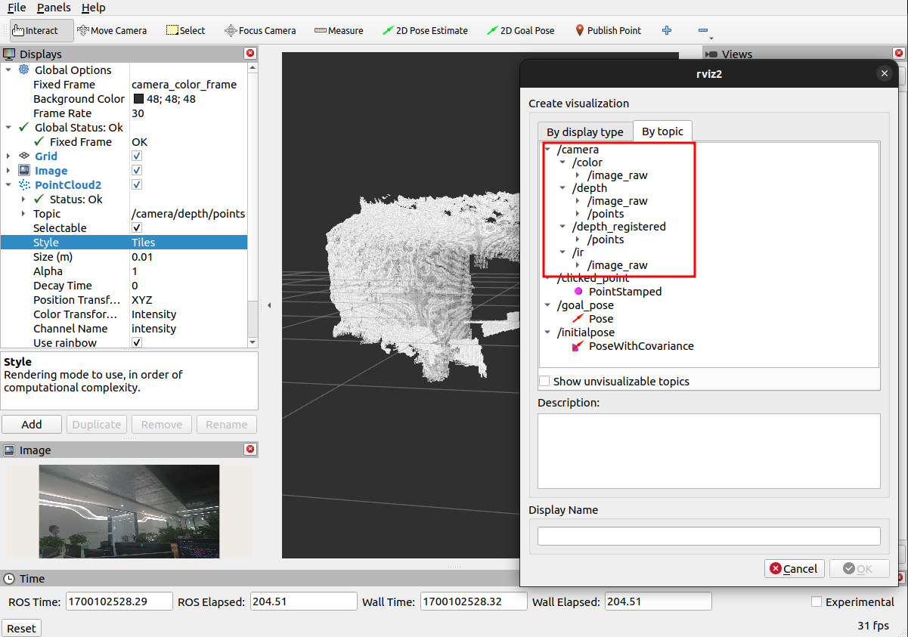

# Orbbec SDK ROS2 Wrapper

## 1.ROS1 And ROS2

The Orbbec SDK ROS2 Wrapper is a ROS2 wrapper for the [Orbbec SDK](https://github.com/orbbec/OrbbecSDK). It provides a ROS2 interface for the Orbbec 3D camera, and is compatible with the ROS2 Foxy, Galactic, and Humble distributions.

*For the ROS1 user, we also have a ROS1 version of the wrapper, which is compatible with the ROS1 Kinetic, Melodic, and Noetic distributions. For more information, please refer to the [Orbbec SDK ROS wrapper](https://github.com/orbbec/OrbbecSDK_ROS1) repository.*

## 2.Installation

### 2.1 Step 1: Install the ROS2 distribution

Please refer to the official guide:

* [Ubuntu (Debian): Foxy](https://docs.ros.org/en/foxy/Installation/Ubuntu-Install-Debians.html)
* [Ubuntu (Debian): Galactic](https://docs.ros.org/en/galactic/Installation/Ubuntu-Install-Debians.html)
* [Ubuntu (Debian): Humble](https://docs.ros.org/en/humble/Installation/Ubuntu-Install-Debians.html)
* More guides for other ROS2 distributions and operating systems can be found [here](https://docs.ros.org/).

After installing ROS2, don't forget to source the environment: [Configuring-ROS2-Environment](https://index.ros.org/doc/ros2/Tutorials/Configuring-ROS2-Environment/)

If you cannot use the auto-complete feature, you can add the following two lines to your `.bashrc` or `.zshrc` file.

```bash
eval "$(register-python-argcomplete3 ros2)"
eval "$(register-python-argcomplete3 colcon)"
```

### 2.2 Step 2: Install dependencies

* Install dependent ROS2 packages

  * Install ROS packages by:

    ```bash
    sudo apt install ros-$ROS_DISTRO-image-transport \
    ros-$ROS_DISTRO-image-publisher \
    ros-$ROS_DISTRO-camera-info-manager
    ```

  * For example, for Humble distro:

    ```bash
    sudo apt install ros-humble-image-transport \
    ros-humble-image-publisher \
    ros-humble-camera-info-manager
    ```

* Install dependent libraries

    ```bash
    sudo apt install libgflags-dev nlohmann-json3-dev libgoogle-glog-dev
    ```

### 2.3 Step 3: Install the Orbbec SDK ROS2 Wrapper

* Create a ROS2 workspace

    ```bash
    mkdir -p ~/ros2_ws/src # you can replace `~/ros2_ws` with your own workspace path
    ```

* Clone the latest OrbbecSDK ROS2 wrapper from [here](ttps://github.com/orbbec/OrbbecSDK_ROS2.git) into `~/ros2_ws/src/`

    ```bash
    cd ~/ros2_ws/src
    git clone https://github.com/orbbec/OrbbecSDK_ROS2.git
    ```

* Build

    ```bash
    cd ~/ros2_ws/
    colcon build --event-handlers  console_direct+  --cmake-args -DCMAKE_BUILD_TYPE=Release
    ```

* Install udev rules file to get usb device access permission

    ``` bash
    cd  ~/ros2_ws/src/OrbbecSDK_ROS2/orbbec_camera/scripts
    sudo bash install_udev_rules.sh
    sudo udevadm control --reload-rules && sudo udevadm trigger
    ```

* source environment (**do this every time you open a new terminal**)

    ``` bash
    cd ~/ros2_ws/
    source ./install/setup.bash  # or source ./install/setup.zsh if you are using zsh
    ```
## 3.Usage

### 3.2 Overview

The Orbbec SDK ROS2 Wrapper contains 4 nodes, which are packaged in the `orbbec_camera` package.

#### 3.2.1 start `orbbec_camera_node`

This `orbbec_camera_node` is the main node to configure device and get data stream from device. It always need to be launched with a launch file, because it needs to be configured with many parameters, such as image resolution, image format, etc.

* Launch camera node

    ```bash
    # On terminal 1
    # gemini2.launch.py is a predefined launch file for Orbbec Gemini 2, see below for more details
    ros2 launch orbbec_camera gemini2.launch.py
    ```

* Launch rviz2 to view stream

    ```bash
    # On terminal 2
    rviz2
    ```

After rviz2 is launched, add `/camera/depth/points/PointCloud2` or other topics in `Displays` tab, then you can see the stream.




#### 3.2.2 Use Other nodes to get useful information

* `list_devices_node`: used to list all connected devices, and print out the information of each device.

    ``` bash
    # make should you device has been connected and has not been open by other node before run this.
    ros2 run orbbec_camera list_devices_node
    ```

* `list_camera_profile_mode_node`: used to list all supported camera and profile (resolution, frame rate, image format) of the default device (the first device enumerated).

    ``` bash
    # make should you device has been connected and has not been open by other node before run this.
    ros2 run orbbec_camera list_camera_profile_mode_node
    ```

* `list_depth_work_mode_node`: For some models (Gemini 2, Gemini 2 L and Gemini 2 XL), there are multiple depth work modes. This node is used to list all supported depth work mode for default device (the first device enumerated).

    ``` bash
    # make should you device has been connected and has not been open by other node before run this.
    ros2 run orbbec_camera list_depth_work_mode_node
    ```

### 3.3 The launch file of camera `orbbec_camera_node`

#### 3.3.1 Predefined launch files for different devices

Orbbec SDK ROS Wrapper supported so many devices, different device has different features and limitations. Therefore, writing a launch file that is compatible with all devices can be challenging, and it can be difficult for users to ensure that their launch file is completely accurate. For this reason, we have provide a set of pre-defined launch files for different devices in the `orbbec_camera/launch` directory.

| **products**     | **firmware version**             |**launch file**          |**description**                                           |
| ---              | ---                              | ---                     | ---                                                     |
| Gemini 2         | 1.4.60 /1.4.76                   | gemini2.launch.py       | [doc](orbbec_camera/launch/gemini2.desc.md )        |
| Gemini 2 L       | 1.4.32                           | gemini2L.launch.py      | [doc](orbbec_camera/launch/gemini2L.desc.md )       |
| Gemini 2 XL      | Obox: V1.2.5  VL:1.4.54          | gemini2XL.launch.py     | [doc](orbbec_camera/launch/gemini2XL.desc.md )      |
| Gemini           | 3.0.18                           | gemini.launch.py        | [doc](orbbec_camera/launch/gemini.desc.md )         |
| Gemini E         | 3460                             | gemini_e.launch.py      | [doc](orbbec_camera/launch/gemini_e.desc.md )       |
| Gemini E Lite    | 3606                             | gemini_e_lite.launch.py | [doc](orbbec_camera/launch/gemini_e_lite.desc.md )  |
| Femto            | 1.6.7                            | femto.launch.py         | [doc](orbbec_camera/launch/femto.desc.md )          |
| Femto W          | 1.1.8                            | femto.launch.py         | [doc](orbbec_camera/launch/femto.desc.md )          |
| Femto Bolt       | 1.0.6  (unsupported ARM32)       | femto_bolt.launch.py    | [doc](orbbec_camera/launch/femto_bolt.desc.md )     |
| Femto Mega       | 1.1.7  (ubuntu20.04,ubuntu22.04) | femto_mega.launch.py    | [doc](orbbec_camera/launch/femto_mega.desc.md )     |
| Astra+           | 1.0.22/1.0.21/1.0.20/1.0.19      | astra_adv.launch.py     | [doc](orbbec_camera/launch/astra_adv.desc.md )      |
| Astra Mini Pro   | 1007                             | astra.launch.py         | [doc](orbbec_camera/launch/astra.desc.md )          |
| Astra Mini S Pro | 1.0.05                           | astra.launch.py         | [doc](orbbec_camera/launch/astra.desc.md )          |
| Astra 2          | 2.8.20                           | astra2.launch.py        | [doc](orbbec_camera/launch/astra2.desc.md )         |
| DaBai            | 2436                             | dabai.launch.py         | [doc](orbbec_camera/launch/dabai.desc.md )          |
| DaBai DW         | 2606                             | dabai_dw.launch.py      | [doc](orbbec_camera/launch/dabai_dw.desc.md )       |
| DaBai DCW        | 2460                             | dabai_dcw.launch.py     | [doc](orbbec_camera/launch/dabai_dcw.desc.md )      |

**Note**:

1. You should choose the launch file that is compatible with your device and modify it according to your needs (enable/disable camera, set camera profile, set depth work mode, set parameters, etc).
2. Read the description document of each device on the right column to get more information about the launch file.
3. This table is also have listed all currently supported devices and their lowest supported firmware version.

#### 3.3.2 What parameters contained in launch file

For `orbbec_camera_node`, we have provided a set of parameters that can be used to configure the node and the device.

1. All parameters and it's description can be found in [docs/launch_file_parameters.md](docs/launch_file_parameters.md).
2. As above section says, different devices have different features and limitations. **Please refer to the predefined launch files and its description doc to ensure what parameters can be used and what value can be set for your device.**

### 3.4 Subscribe topics to get image and other data

The published topics differ according to the device and parameters. After running the above command with Gemini 2 attached, the following list of topics will be available (This is a partial list. For full one type `ros2 topic list`):

|Feature|Topic|Description|Device Model|
|---|---|---|---|
|Color|`/camera/color/camera_info`|The color camera info.|Gemini2|
|Color|`/camera/color/image_raw`|The color stream image.|Gemini2|
|Depth|`/camera/depth/camera_info`|The depth camera info.|Gemini2|
|Depth|`/camera/depth/image_raw`|The depth stream image.|Gemini2|
|IR|`/camera/ir/camera_info`|The IR camera info.|Gemini2|
|IR|`/camera/ir/image_raw`|The IR stream image.|Gemini2|
|PointCloud|`/camera/depth/points` |The point cloud, only available when enable_point_cloud is true.|Gemini2|
|PointCloud|`/camera/depth_registered/points`|The colored point cloud, only available when enable_colored_point_cloud is true.|Gemini2|
|imu|`/camera/accel/sample`| The accelerometer sample data.|Gemini2|
|imu|`/camera/gyro/sample`| The gyroscope sample data.|Gemini2|

### 3.5 Get/Set services on runtime

After the `orbbec_camera_node` launched, you can use services to get/set the camera parameters and control the camera on runtime.

For example:

```bash
# get color camera exposure time
ros2 service call /camera/get_color_exposure orbbec_camera_msgs/srv/GetInt32 '{}'
# set color camera exposure time
ros2 service call /camera/set_color_exposure orbbec_camera_msgs/srv/SetInt32 '{data:156}'

# List all available services
ros2 service list -t | grep camera
```

All available services and it's description can be found in [docs/services.md](docs/services.md).


## 4.Advanced usage

### 4.1 Multiple devices

Using multiple devices to capture camera data from multiple angles and positions can provide more information and diversity to enhance the performance of application algorithms, please refer to [docs/multiple_devices.md](docs/multiple_devices.md) to configure and launch multiple devices.

### 4.2 Use hardware decoder to decode JPEG

#### 4.2.1 rockchip and Amlogic

Depends on `rockchip-mpp-dev` and `rockchip-rga-dev`, not all systems have these two packages, the names may be
different, please search by yourself.
Open `CMakeLists.txt` and set `USE_RK_HW_DECODER` to `ON`.

#### 4.2.2 Nvidia Jetson

Depends on: `jetson_multimedia_api`,`libyuv`.
Open `CMakeLists.txt` and set `USE_NV_HW_DECODER` to `ON`.

### 4.3 Depth work mode switch

* The depth work mode switch is supported by Gemini 2, Gemini 2 L, and Gemini 2 XL cameras.
* Before starting the camera, depth work mode (depth_work_mode) can be configured for the corresponding xxx.launch.py file's support.
* The default depth work mode configuration of xxx.launch.py is the camera's default configuration. If you need to modify it, you can switch to the corresponding mode as needed.
* The specific camera depth work mode support types can be found in the comments of the depth mode.

```python
    # Depth work mode support is as follows:
    # Unbinned Dense Default
    # Unbinned Sparse Default
    # Binned Sparse Default
    DeclareLaunchArgument('depth_work_mode', default_value='')
```

* View depth work modes:

```bash
ros2 run orbbec_camera list_depth_work_mode_node
```

### 4.4 Configuration of depth NFOV and WFOV modes

For the Femto Mega and Femto Bolt devices, the NFOV and WFOV modes are implemented by configuring the resolution of Depth and IR in the launch file.
In launch file, depth_width、depth_height、ir_width、ir_height represents the resolution of the depth  and the resolution of the IR.
The frame fps and resolution of IR must be consistent with the depth. The correspondence between different modes and resolutions is as follows:

* NFOV unbinned: 640 x 576.
* NFOV binned: 320 x 288.
* WFOV unbinned: 1024 x 1024.
* WFOV binned: 512 x 512.

### 4.5 DDS Tuning

The default DDS settings (Galactic) may not be optimal for data transmission， which may cause the data stream frame rate to fall short of the configuration requirements.

Please refer to [docs/dds_tuning.md](docs/dds_tuning.md) to optimize the DDS settings.

## 5. Frequently Asked Questions

* It's possible that the power supply is insufficient.
  To avoid this, do not connect all cameras to the same hub and use a powered hub instead.

* It's also possible that the resolution is too high.
  To resolve this, try lowering the resolution.

* Why are there so many launch files here?
    The reason for the presence of multiple launch files is due to the fact that the default resolutions and image formats of different cameras vary.To make it easier to use, the launch files have been separated for each camera.

## 6. License

Copyright 2023 Orbbec Ltd.

Licensed under the Apache License, Version 2.0 (the "License"); you may not use this project except in compliance with
the License. You may obtain a copy of the License at

[http://www.apache.org/licenses/LICENSE-2.0](http://www.apache.org/licenses/LICENSE-2.0)

Unless required by applicable law or agreed to in writing, software distributed under the License is distributed on an "
AS IS" BASIS, WITHOUT WARRANTIES OR CONDITIONS OF ANY KIND, either express or implied. See the License for the specific
language governing permissions and limitations under the License.
